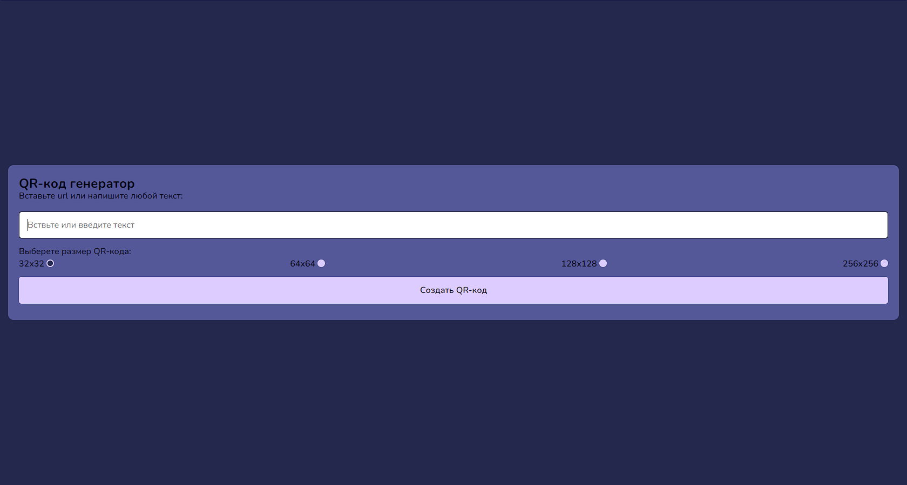
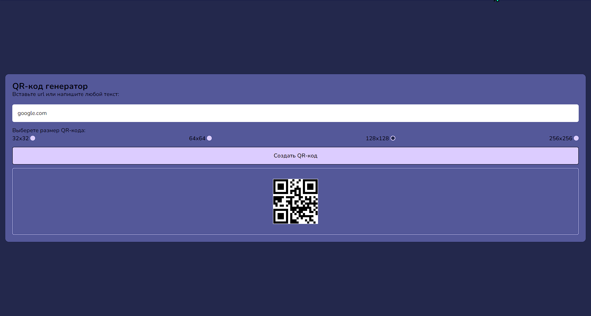

# QR-код генератор :star2: :collision:

:point_right: **Ссылка на просмотр проекта** - https://demensferre.github.io/qr-generate/ :point_left:

---

**_Скриншоты состояний преокта:_** :point_down:

---

## Немного о проекте

:muscle: **QR-код генератор** - это мой мини-проект написанный за пару дней на таких технологиях как: HTML5, CSS3, JS(ES6). Приложение как понятно из названия способоно генерировать qr-коды в разных размерах, с любым текстом или url адресом. :blush:

---

## Как запустить проект на своем ПК

- Клонируем git-репеозиторий к себе - `git clone https://github.com/DemensFerre/qr-generate.git`

- Заходим в проект и запускаем любой локальный серевер ( Например live server в VS Code )
